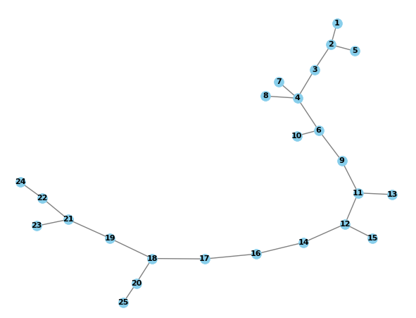

# blockchain_assignment1
Build Own discrete-event simulator for a P2P cryptocurrency
network.
A discrete-event simulator maintains an ”event-queue” from which the earliest event is executed. This event may create further future events which get added to the queue. For example,
an event in which one node ”sends a block” to connected peers will create future events of ”receive block” at its peers.

- Tasks
1. slow and slow cpu peers
2. Exponential parameter
    - 4 marks implementation 
    - 2 marks why exponential (report)
3. Transaction: TxnID: IDx pays IDy C coins
4. Connected graph (3 and 6 peers)
    - 4 marks
5. Latencies
    - 12 marks
    - justification - 2marks
6. Loopless forwardingg
    - 4marks
7. PoW = block struct, creation, validation, mining, propagation, Tk
    - 20 marks
    - Fork resolution - 8 marks
8. Tree file
    - 10 marks

---
visualisation 
    - 12 marks
    - insight - 8 marks

Comments of code - 4marks
Design document - 8marks
Readme file 2marks

---
Command line
n, z, Ttx, Tk, edges,  invalid_txn_prob, invalid_block_prob, zeta, adv, alpha

---
Sample block chain
-  python3 main.py -n 10 --slow 0.5 --low 0.1 -Ttx 6 --blockinterval 6 > test
- 

----
TODO: 
1. Visualise and tabulate 
2. Theory questions in report
3. Code and challenges (very small description for each module)
4. DESIGN DOCUMENT
5. comments, readme for instructs - mention where chatgpt is used
6. analyse our latency in order to make the report & also check the graph which comes out (as line please!)
7. look at documentation for event queue simulator
8. 
